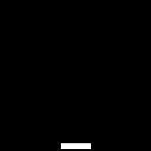

# Playing Catcher with Reinforcement Learning

## Intro ##
I implement Deep Q-Learning, a recent advance in deep reinforcement learning introduced in a [paper](https://www.cs.toronto.edu/~vmnih/docs/dqn.pdf) by Google DeepMind, to train an agent to play the classiic Catcher. The follow image (credited to Pygame Learning Environments) pretty much describes the game



Only by observing raw pixels, the best trained agent managed to score **1071** points, which is way above my own performance of *126* (I honestly did try my best).

My model is 3-layer convolutional network, followed by a fully-connected layer that predicts an action `left` or `right` solely based on observing the pixels from the game screen.

At training time, I sample game trajectories either by taking random actions or by asking the model to take the action that it thinks to have highest expected rewards. The trajectories are saved into a replay memory, represented by a deque, from which the model can sample past experience to improve upon.

## Installation ##
This repository has several dependencies.
* **Tensorflow**: we recommend Google's installation [guide](https://www.tensorflow.org/versions/r0.10/get_started/os_setup.html#pip-installation).
* **pygame**: please use the installation [guide](http://pygame.org/wiki/macintosh) using `homebrew`. If you prefer, please change their `pip3` into `pip2.7` or simply `pip` to use your preferred version of python.
```
export PATH=/usr/local/bin:$PATH
ruby -e "$(curl -fsSL https://raw.github.com/Homebrew/homebrew/go/install)"
brew install hg sdl sdl_image sdl_mixer sdl_ttf portmidi
pip install hg+http://bitbucket.org/pygame/pygame
```
* **OpenCV**: please follow the installation [guide](http://opencv.org/).

## Usage ##
To play the game using a saved agent in the folder `saved_models`:
```
python dl_catcher.py
```

To train a model from scratch, saving the model files to `saved_models/model-checkpoint-xxx`:
```
rm -rf saved_models
mkdir -p saved_models
python dl_catcher.py -t model-checkpoint
```

## Disclaimer ##
This work uses the dependency of [PyGame Learning Environment (PLE)](https://github.com/ntasfi/PyGame-Learning-Environment)

